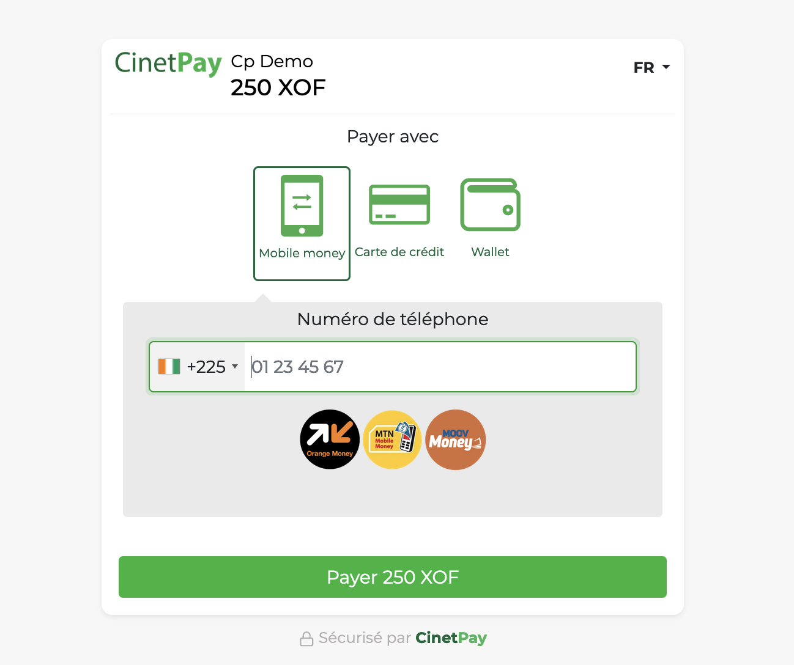
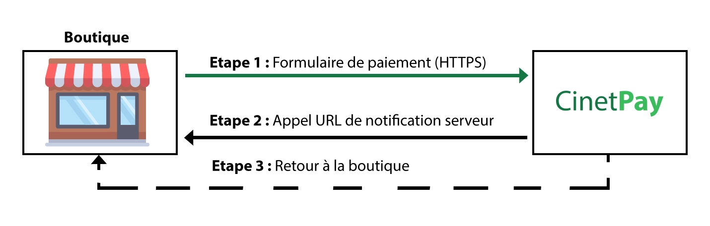
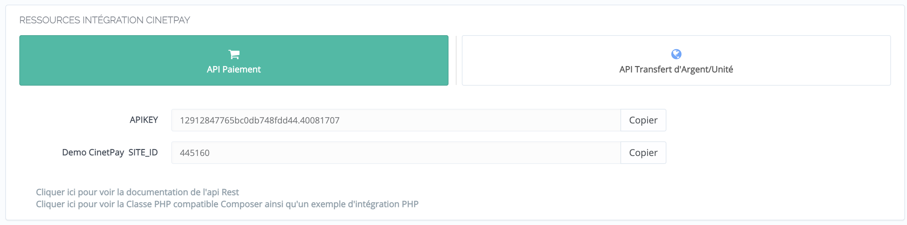

## L'API de Checkout

L'API de Checkout permet à tous les marchands CinetPay d'encaisser des fonds via mobile money, cartes bancaires ou wallets par la mise en place de processus automatique basé sur le protocole `HTTP` et le format de données `JSON`. 

Cela ce matérialise par l'extension de l'application des marchands, que nommons **boutique**, avec un guichet de paiement proposant divers moyens de paiement. 

**Le guichet** est une simple page web sur laquelle votre client est redirigé depuis votre boutique pour effectuer son paiement. Voyez ci-dessous une capture du guichet de paiement.



On remarquera que celui-ci est très élégant 😊.

## Le système de checkout

Du point de votre client, il ne s'agira que d'effectuer le paiement. Cependant, votre boutique doit pouvoir effectuer les trois actions suivantes :

1. Initialiser l'affichage du guichet après que votre client ai déclenché une action nécessitant un paiement (étape 1)
2. Rediriger le client sur le guichet de paiement. Après le paiement CinetPay redirigera le client vers une page de votre boutique que vous aurez choisi (étape 3)
3. Délivrer oui ou non le service demander par le client après traitement du statut de paiement (succès/échec) reçu en **backend** par votre boutique et envoyé par CinetPay (étape 2)



Notons que les étapes 2 et 3 semblent se passer presque en même temps, mais retenez qu'en réalité l'étape 2 à lieu avant la 3.

!!! Warning "A votre attention"
        Par **"statut de paiement reçu en backend"**, nous entendons une requête HTTP envoyée par CinetPay, spécifique à chaque paiement, représentant une notification sur la statut courant d'un paiement; à votre boutique, qui est censé déclencher une action si nécessaire. Voir la section sur [l'url de notification](#la-notification).

## Mise en oeuvre

Comme vous l'avait certainement remarqué, le système de checkout fonctionne selon un processus relativement simple et intuitif. Toutefois, pour que vous puissez l'utiliser au travers de l'API de Checkout, vous devez posséder un compte marchand actif sur CinetPay et disposer de clés d'API.

### Créer un compte marchand

Si vous ne disposez pas d'un compte marchand CinetPay, rendez vous sur la page de création d'un compte en cliquant sur le bouton ci-dessous. Sinon vous pouvez passer au point suivant.

[Nouveau compte marchand](https://app.cinetpay.com/signup/emailvalidation){ .md-button .md-button--primary }

### Obtenir les clés d'API

Tout API qui se respecte se doit d'avoir un mimimun de sécurité en fonction du service délivré. Dans le cas de CinetPay, l'accès à l'API de checkout est autorisé par la connaissance de deux clés, l'***API KEY*** et le ***SITEID***.

Pour obtenir ces deux clés, connectez vous à votre compte marchand et rendez vous dans la section intégrations de votre espace marchand. Vous y trouverez les différentes clées comme illustrée dans la capture ci-dessous.



!!! Danger "Attention"
        Retenez bien que l'***API KEY*** et le ***SITEID*** sont indispensables pour réussir l'intégration de l'API.

Avec ces deux clées et votre connaissance du système de checkout, nous pouvons passer a l'intégration du l'API. Mais il reste encore un dernier point à présenter. Il s'agit de **la notification**. En effet, seule la notification peut permettre de délivrer le service demander par votre client car c'est t'elle qui vous permettra de savoir si un paiement a réussi ou a échoué, d'où sa pertinence et la nécessité de bien comprendre son fonctionnement.

## La notification

### Principe

La notification est l'étape du processus de traitement des paiements qui consiste à remonter à votre boutique le changement du statut d'un paiement envoyé à CinetPay. 

Comprenez bien que CinetPay ne fait que vous notifier qu'il y'a eu un changement de statut sur l'un de vos paiements, mais ne donne pas les informations sur son statut (ne précise pas s'il s'agit d'un echec, d'un succès ou d'une transition), parcontre vous aurez comme données l'***identifiant du paiement*** et votre ***SITEID***. 

Exemple de donnée de notification venant de CinetPay:

``` json hl_lines="2"
{
    "cpm_trans_id":"xxxxxx",
    "cpm_site_id":"xxxxxx"
}
```

Pour avoir les détails sur le statut du paiement, il vous faudra utiliser l'endpoint de l'API permettant de vérifier le statut d'un paiement à partir son ***identifiant***, or souvenez vous que CinetPay vous notifie toujours avec l'***identifiant du paiement***.

!!! Question "Recommandation"
        Relisez ce dernier paragraphe jusqu'à ce que vous ayez bien compris la notification avant de continuer.

### Pourquoi cette approche

La raison de cette approche est toute simple. CinetPay ne vous envoie pas les informations sur le statut d'un paiement pour  éviter certaine faille de sécurité comme le [man in the middle](https://fr.wikipedia.org/wiki/Attaque_de_l'homme_du_milieu) . Il s'agit donc d'une mesure de sécurité pour garantir l'intégrité de vos paiements.

### Comment CinetPay notifie ma boutique ?

Vous vous demandez peut-être comment CinetPay fait pour notifier votre boutique. Pour vous notifier, CinetPay se base sur une l'url, que l'on nomme **url de notification** que vous serez amené à fournir lors de l'envoie de l'initialisation d'un paiement pour l'affichage du guichet ([Voir la section sur le système de checkout](#le-systeme-de-checkout)). Cette l'url doit être disponible avec les méthodes `POST` et `GET` (La reponse de ces appels n'est pas considérée par CinetPay).

Exemple de la structure de donnée pour l'initialisation d'un paiement:

``` json hl_lines="9"
{
    "amount": 2500,
    "apikey": "XXXXXXXXXXXXXXXX",
    "site_id": "XXXXX",
    "currency": "XOF",
    "transaction_id": "REFID12354",
    "description": "TRANSACTION DESCRIPTION",
    "return_url:": "https://www.exemple.com/return",
    "notify_url:": "https://www.exemple.com/notify",
    "customer_name:": "Dje Bi",
    "customer_surname:": "Jean-Marc"
}
```

Assurer vous donc de toujours fournir une url fonctionnelle et qu'elle prend en charge les requêtes de type `POST` et `GET`([Voir la section notification de l'intégration]()).

### Bon à savoir

Les points qui suivent sont a considérer pour une bonne intégration.

- L'url de notification doit être le seul mécanisme à implémenter pour synchroniser les statuts de vos paiements avec ceux de CinetPay. Etant donné que vous pouvez vérifier le statut de vos paiements à l'aide de l'endpoint de vérification ([Voir la section vérification de l'intégration](#)), vous serez peut être tenté d'utiliser des tâches CRON. Cette pratique est à éviter strictement sous peine de corrompt votre boutique. CinetPay appellera votre url de notification après chaque mise à jour pour vous notifier du changement de statut pendant le déroulement d'un paiement.

- A la fin d'un paiement, CinetPay appelle systématiquement votre url de notification. Cet appel a pour but d’informer votre boutique de l’état du paiement, même si le client l'ayant initié ne revient pas dans votre boutique. Vous pourrez ainsi valider des commandes si le paiement est vérifié et accepté par exemple.

- L'url de notification n’est pas nécessaire si vous n’avez pas besoin d’avoir le statut des paiements dans votre base de données, car vous avez l'historique de vos paiements dans votre espace marchand. Exemple : Application de collecte de dons.

### Conseils d'usage

Sachant que l'url de notification peut être appelée plusieurs, et pour vous assurer de l’intégrité des données que vous traitez, vous devez effectuer certaines vérifications :

1. Votre url de notification doit être une api qui doit recevoir un appel en POST avec comme données d'entrée le `cpm_trans_id` (Correspondant à l'identifiant du paiement) et le `cpm_site_id` (Correspondant à votre SITEID)

2. Après les avoir obtenu suite à la reception d'une requête de notification venant de CinetPay, vous devez toujours vérifier dans votre base de données si le statut du paiement concerné est déjà à succès :

    - Si oui alors vous ne faites plus de mise à jour

    - Sinon vous devez faire un appel à l’api de vérification de transaction avec le `cpm_trans_id` et le `cpm_site_id`, pour obtenir le statut de la transaction chez CinetPay et mettre ainsi à jour le statut dans votre base de données.

---

<center>

</center>


🎉 Félicitation vous venez de terminer votre apprentissage du fonctionnement de l'API de Checkout. Vous pouvez passer maintenant, et sereinement 😎, à l'intégration. N'hésitez pas à revenir ici en cas d'imcompréhension.

[Comprendre l'intégration](/integration){ .md-button .md-button--primary }

*Dernière mise à jour le 02/08/2021 par Jean-Marc Dje Bi*

